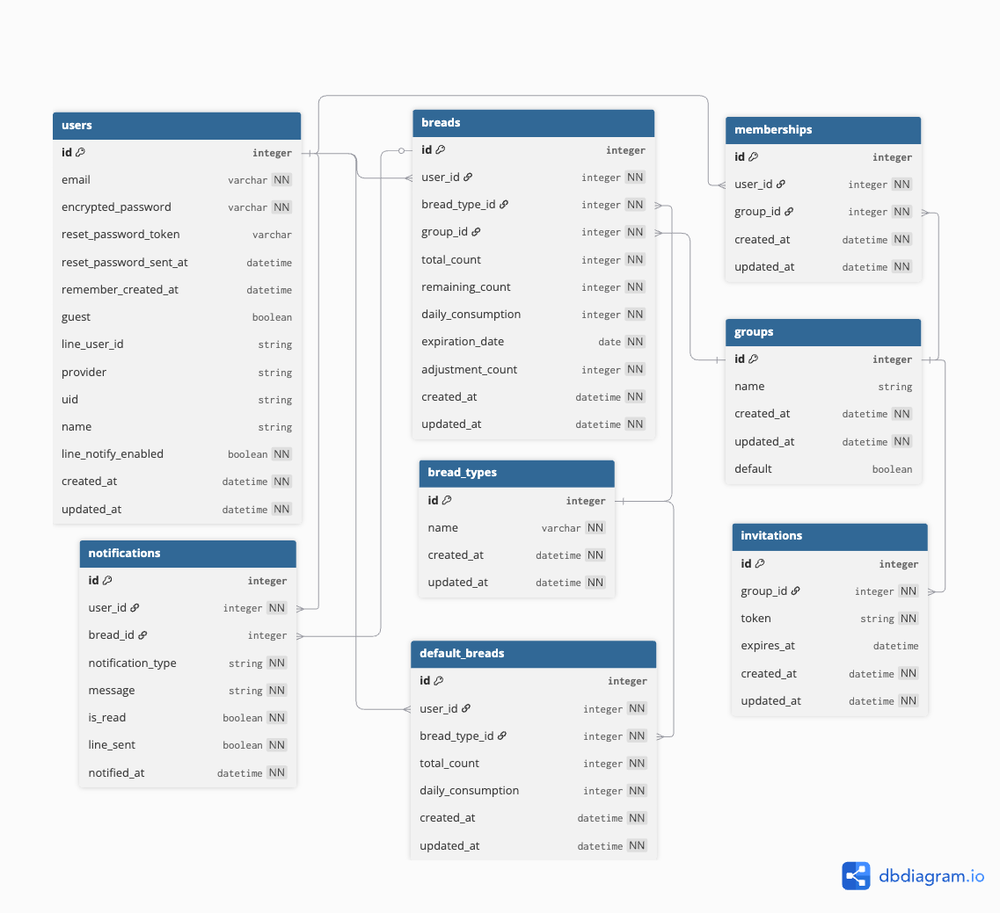

## パンの在庫管理アプリ　Pankabi

## サービス概要
パンの残り数と消費期限を管理一目で確認できます。 
1日のパンの消費ペースを決めることで、残りの数は自動計算されます。
これによって購入や冷凍保存のタイミングを迷わず判断できるようサポートします。 
気づいたらパンにカビが生えてしまっていた、という残念な体験を防ぐことも目的としています。  
日常の小さな「考える手間」を減らし、パンを無駄にしない生活を目指します。

## サービスURL
https://pankabi.com

## サービスの開発背景
私は昔から朝食はパン派です。
食パンを1日1枚ずつ食べていくと、夏場は冷凍しない限りカビが生えてしまいます。
パンを食べようとしたときにカビが生えていると、どうしても悲しい気持ちになります。

しかし、食パンを小分けにして冷凍する作業は意外と面倒で、
「あとでやろう」と後回しにしてしまうことが多くありました。

また、買い物の際に
「今、食パンはあと何枚残っていたか」
「今日は買うべきか、それとも次回で良いか」
と悩むことがよくあります。
こうした在庫確認や購入判断は小さなことですが、日常の中では意外とストレスになります。

もしパンの残り枚数や消費ペースをアプリで簡単に確認できれば、
冷凍するタイミングや購入の判断を迷わずに済み、
カビの生えたパンにショックを受けることも減らせるのではないかと考えました。

「考える手間」を減らし、日常を少し楽にしたいと思い、
このサービスを作ろうと考えました。

## ユーザー層について
- パンを定期的に購入する人
- パンの在庫や消費ペースを感覚で管理している人
本サービスは、
業務向けではなく、個人や家庭で
パンの購入判断や管理を楽にしたい人を対象としています。

## 機能紹介
### 基本的な使い方の流れ
①パンを購入

②パンの情報を入力

③カードでパンの状態（消費期限や残りの在庫数）を確認

④食べ終わったら完食ボタンを押す

### 便利な機能
- **いつも食べるパンの設定** 
会員登録していると、いつも食べるパンを登録することができ、パンの登録時に消費期限の入力だけでパンを登録できます。

- **消費期限を画像から読み取り**
消費期限が分かるよう、写真を撮影し、写真から文字を読み取り消費期限を登録することができます。

- **LINEで通知を受け取る** 
LINEと連携するとパンの消費期限近づいたり、在庫がなくなりそうになるとLINEでPankabiアプリからメッセージを受け取ることができます。

## サービスの差別化ポイント
本サービスは、対象を「パン」に特化した在庫・消費管理アプリです。
特に、食パンやロールパンなど、複数入りのパンを定期的に購入する人を想定しています。
### パンに着目した理由
本サービスで対象としているのは、パン屋の単品パンではなく、
- 食パン（5枚切り・6枚切り）
- ロールパン
- 複数個入りの菓子パン
など、数日に分けて消費するタイプのパンです。
これらのパンには、以下のような特徴があります。
- 数日〜1週間ほどかけて消費する
- 消費ペースが比較的一定
- 消費期限が短く、廃棄につながりやすい
- 「今買うべきか」を判断する場面が多い
- 冷凍するか・次回購入を見送るかの判断が発生しやすい

### 本サービスの特徴
- 食パン5枚切り・6枚切り、ロールパンなど様々な形状に対応
- 一度登録した内容はデフォルト入力され、入力負担を軽減
- 食べた記録を毎回入力しなくても、残数を把握しやすい設計
- 「今買うべきか」を少ない入力で判断できる
### 差別化ポイント
「パン」に対象を絞ることで、
- 在庫管理
- 消費ペース
- 購入タイミングの判断 
をシンプルに支援できる点が、本サービス最大の特徴です。

## 機能一覧
### MVP
- ユーザー登録・ログイン機能
- ゲストログイン機能
- パスワード再設定
- 購入したパンの情報を登録
- ホーム画面にパンの状態・消費期限・残り数を表示
  - 1日の消費数から在庫数を自動計算するロジック
  - パンの状態が分かる動的な表示
- スマートフォンでの利用を前提としたレスポンシブUI設計
- パン登録を簡略化するため、いつも食べるパンを登録できる機能
- パンの情報をLINE共有

### 本リリース
- グループ機能
  - 家族間でパン情報を共有
- OCR機能
  - カメラによる消費期限読み取り
- 通知機能
  - アプリ内通知
  - LINE通知
  - 通知ON/OFF設定

### ゲストと会員の機能比較
| 機能 | ゲスト | 会員 |
|------|--------|------|
| パン登録 | ✅ | ✅ |
|LINEで共有| ✅ | ✅ |
| OCR | ❌ | ✅ |
| 通知機能 | ❌ | ✅ |
| いつも食べるパンの設定 | ❌ | ✅ |
| グループ機能 | ❌ | ✅ |

## 使用する技術スタック
| カテゴリ        | 技術                                    | 選定理由                                                                   |
| ----------- | ------------------------------------- | ---------------------------------------------------------------------- |
| バックエンド      | Ruby on Rails 7.1.6 / Ruby 3.2.2      | CRUDに加えて通知などの処理まで一貫して実装できるため。学習中の技術であり、理解した上で安定した開発が可能なため。 |
| フロントエンド     | JavaScript / Hotwire（Turbo, Stimulus） | Rails標準技術を利用することで、フロントとバックエンドを分断せずに開発できるため。部分的な画面更新によりUX向上が図れるため。      |
| CSSフレームワーク  | Tailwind CSS / DaisyUI                | コンポーネントベースで直感的にUIを構築でき、ポップで分かりやすい画面を短時間で実装できるため。                       |
| データベース      | Neon                            | サーバーレスでRenderと相性が良く、無料枠で個人開発に向く                 |
| 認証          | Devise、OmniAuth                          | 安全なユーザー認証機能を短時間で実装でき、家族共有機能やLINE通知の基盤として利用できるため。                          |
| 外部API連携     | LINE Messaging API           | 日常的に利用されているLINEで通知を行うことで、ユーザーが気付きやすく、家族間での共有にも適しているため。                 |
| 文字認識（OCR）   | Google Cloud Vision API                   | 消費期限入力の手間を減らし、ズボラなユーザーでも使いやすいUXを実現するため。                                |
| インフラ / デプロイ | Render                                | 個人開発でも安定した本番運用が可能なため。                           |
| 環境構築        | Docker                                | 開発環境差異によるトラブルを防ぎ、誰でも同じ環境を再現できるようにするため。                                 |
| CI/CD       | GitHub Actions                        | プルリクエスト時に自動でテストを実行し、品質を保ちながら開発を進めるため。                                     |

## 画面遷移図
  - [画面遷移図](https://www.figma.com/design/mGcQWNAu6rix3Myc0CvQ2X/%E3%83%91%E3%83%B3%E3%82%AB%E3%83%93%E3%81%8A%E7%9F%A5%E3%82%89%E3%81%9B%E3%82%A2%E3%83%97%E3%83%AA?node-id=0-1&m=dev&t=pHMUbDI92hwxMPde-1)

## ER図
  - [ER図](https://dbdiagram.io/d/bread-mold-notifier-694fcdfb39fa3db27ba11652)
 